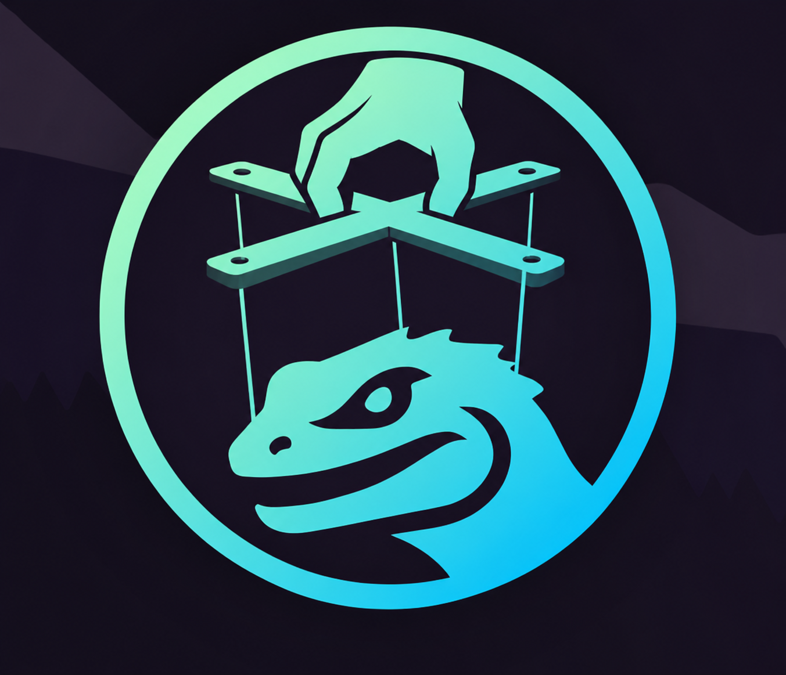

# go-juggler



Go client for the [Juggler](https://deepwiki.com/daijro/camoufox/6.1-juggler-system)
automation protocol. Automates Juggler-enabled browsers such as
Firefox/Camoufox from Go.

## Install

```sh
go get github.com/yvv4git/go-juggler
```

## Usage

```go
package main

import (
    "context"
    "log"

    "github.com/yvv4git/go-juggler"
)

func main() {
    ctx := context.Background()
    c := juggler.NewClient("http://localhost:9377")

    tab, _ := c.OpenTab(ctx, "demo", "http://example.com")
    snap, _ := c.Snapshot(ctx, tab.TabID, "demo")
    c.Click(ctx, tab.TabID, "demo", "e1", "")
    c.CloseTab(ctx, tab.TabID, "demo")
}
```

## Capabilities

| Method                | Description                                                  |
|-----------------------|--------------------------------------------------------------|
| `Health`              | Check browser status (engine, connection, memory)            |
| `OpenTab`             | Open a new tab and navigate to a URL                         |
| `Navigate`            | Load a URL in an existing tab                                |
| `Snapshot`            | Get the ARIA tree of the page (element refs)                 |
| `Click`               | Click an element by ref or CSS selector                      |
| `Type`                | Fill an input field by ref or selector                       |
| `Press`               | Press a keyboard key (Enter, Tab, Escape, etc.)              |
| `Scroll`              | Scroll the page up/down by N pixels                          |
| `Back`                | Navigate back in history                                     |
| `Forward`             | Navigate forward in history                                  |
| `Refresh`             | Reload the current page                                      |
| `Links`               | List all links on the page with pagination                   |
| `Screenshot`          | Take a PNG screenshot (page or viewport)                     |
| `Evaluate`            | Run arbitrary JavaScript in the page context                 |
| `NetworkRequests`     | Get all loaded resources (navigation + subresources)         |
| `PollNetworkRequests` | Poll for resources over time with deduplication              |
| `Stats`               | Get tab state (URL, visited URLs, refs)                      |
| `ListTabs`            | List all tabs in a session (URL, title)                      |
| `CloseTab`            | Close a tab                                                  |
| `CloseSession`        | Destroy an entire session and all its tabs                   |

## Layout

```text
go-juggler/
├── juggler.go          # root package: public API facade
├── transport/          # byte channels: pipe (fd 3/fd 4) and WebSocket
├── protocol/           # Juggler message types, JSON encoding/decoding
├── browser/            # high-level browser and tab control
└── examples/           # runnable example programs
    ├── basic/          # life-cycle demo
    ├── tab/            # all 16 tab operations
    ├── inject/         # JS injection via Evaluate
    └── requests/       # intercept companion network requests
```

Dependencies flow one way, from high level to low level:

`browser/` -> `transport/`, and `protocol/` stays independent so transport
moves raw frames and protocol gives them meaning.

## Links

- [Juggler Protocol Architecture (daijro/camoufox)](https://deepwiki.com/daijro/camoufox/6.1-juggler-system)

## License

MIT, see [LICENSE](LICENSE). See [NOTICE](NOTICE) for attribution.

<p align="center">
  <a href="https://tonviewer.com/UQCcbp-mue-7HTjDNQ_ZrKtg-tUxIFu817APmItjXasiBGP3">
    
  </a>
</p>

<p align="center">
  If this tool helps you, consider buying me a coffee! ☕
</p>
